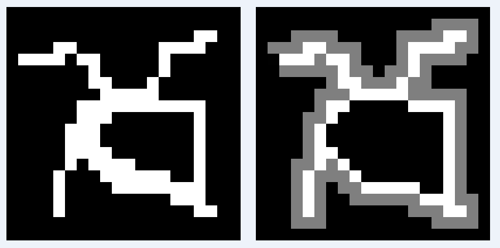

**Feature:**
using Boundary Tracing Algorithm to find the contour of binary image, realized by itk.

**Example:**

- Left image shows the original binary image with threshold 0 and 255;
- Rignt image shows the result grayscale image with contour ( threshold 255 ), background( threshold 0 ) and search route( threshold 128)